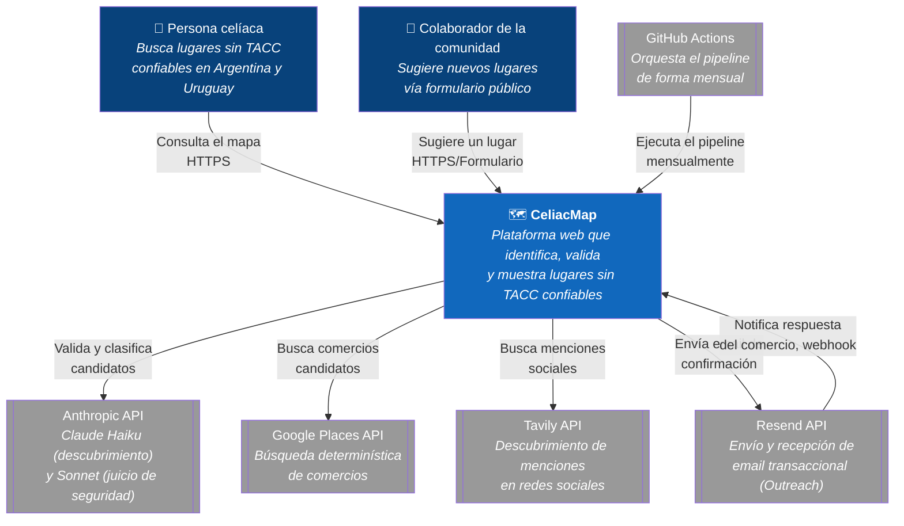
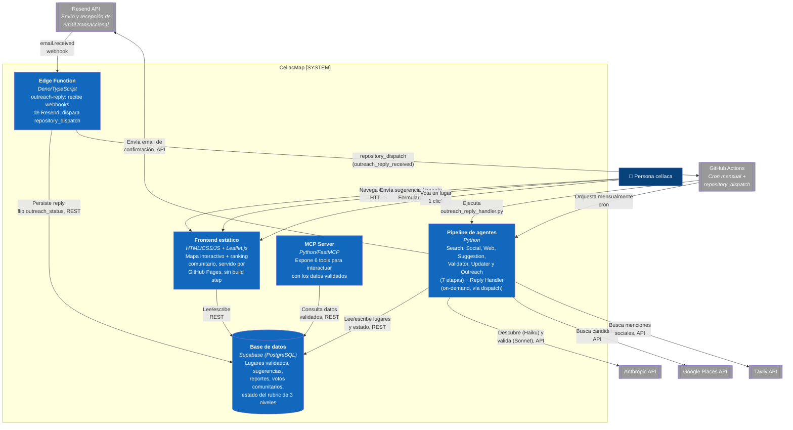

# Diagramas de Arquitectura C4 — CeliacMap

## Nivel 1 — Contexto del sistema

## Nivel 2 — Contenedores

**Nota — ranking comunitario (ADR-005).** El ranking "Los favoritos de la
comunidad" (`js/ranking.js`, dentro del contenedor *Frontend estático*) lee el
top-12 por país del **mismo endpoint anon de `places`** que ya usa el mapa
(vía la columna denormalizada `places.vote_count`) y escribe un voto como un
`POST` plano a la tabla `place_votes` (anon, INSERT-only). El contador se
mantiene con un trigger de base de datos (`sync_place_vote_count`,
`SECURITY DEFINER`) — **sin agente, sin LLM, sin GitHub Actions, sin Edge
Function**: en el diagrama, el borde `frontend → db` simplemente pasa a cubrir
también la escritura de votos.
